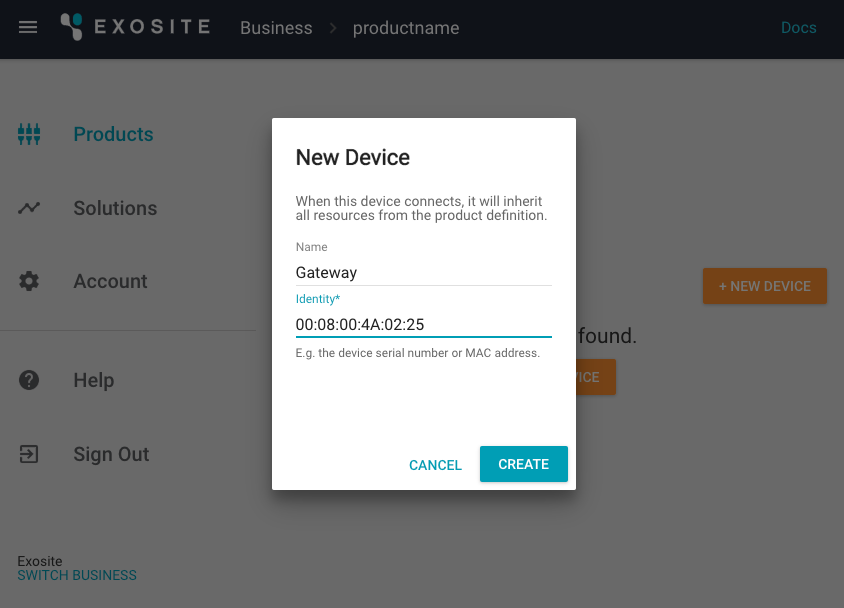
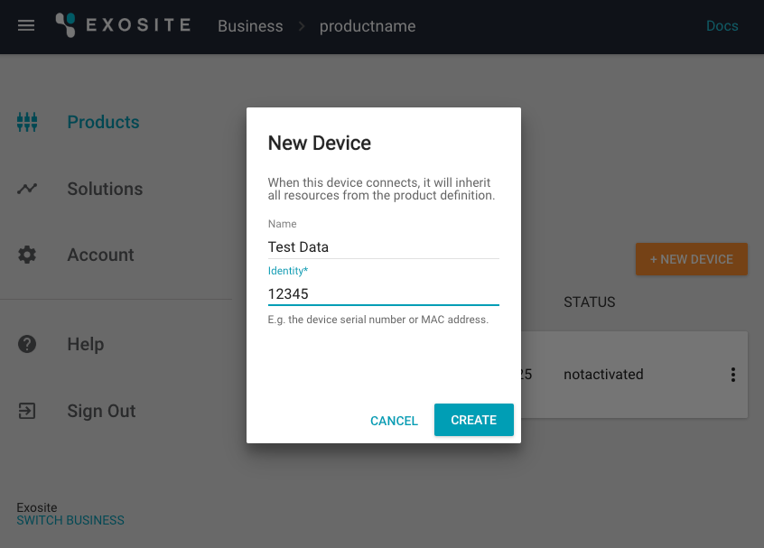
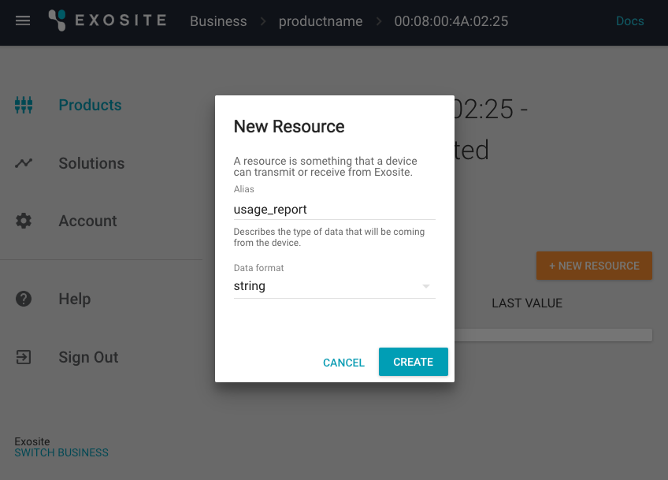
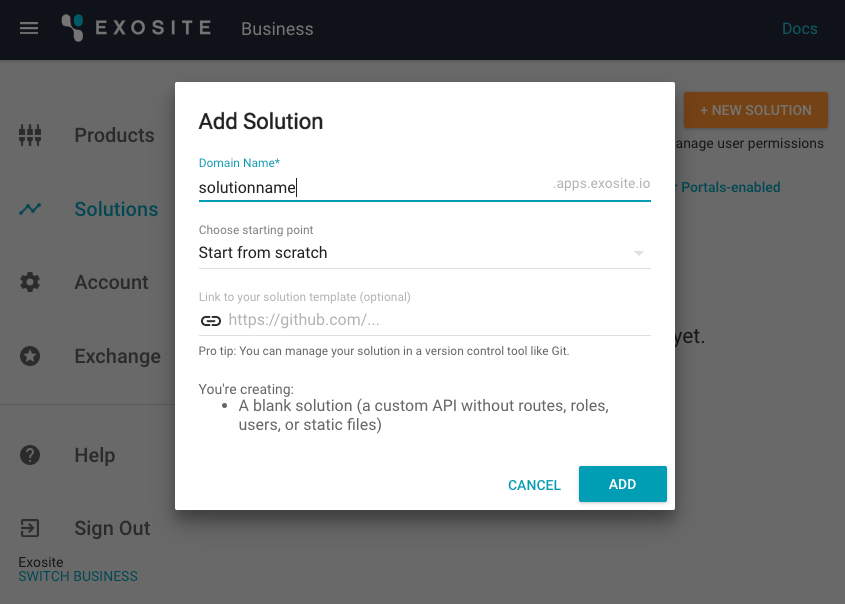

# ExositeReady™ Gateway Engine Solution App

This guide provides an example solution displaying all the telemetric data from ExositeReady™ Gateway Engine (GWE) as well as showing a custom gateway application: "gmq-sine-demo." For additional information and resources, please refer back to the GWE documentation [home page](http://docs.exosite.com/exositeready/gwe/).

# Requirements

This guide requires the installation of GWE on your gateway hardware device. These installation instructions can be found in the [GWE Getting-started Guide](http://docs.exosite.com/exositeready/gwe/getting_started/).

**NOTE:** This is a technical tutorial. You will need some familiarity with your operating system’s terminal.

# Getting Started

## Configure Murano

1. [Create a Murano account](https://exosite.com/signup/) or [log in to your existing account](https://www.exosite.io/).

2. In your browser, navigate to the *Products* tab. 

	1. Click "NEW PRODUCT." 
	2. In the popup box, name your product whatever you like. 
	3. Select *Start from scratch* from the *Choose starting point* drop-down menu. 
	4. Click "ADD."

	

3. Click to open your new product and navigate to the *DEVICES* tab.

	1. Click "NEW DEVICE." 
	2. In the popup box, name your device "Gateway". 
	3. Use your gateway's MAC address as the *Identity*. (Example format "00:08:00:4A:02:25".)
	4. Click "CREATE."

	

4. Refer back to the previous steps to add another new device called "Test Data", using "12345" as the *Identity*.

	

5. Click to open your Test Data device. 
	1. Click "NEW RESOURCE." 
	2. In the popup box, input the *Alias* as “Test” and *Data format* as *float*. 
	3. Click "CREATE."

	

6. Add additional new resources to your "Gateway" device with the *Alias*es "usage_report", "engine_report", "device_info", "update_interval", "engine_fetch", and "fetch_status". Use *string* as the *Data format* for each.

	

7. Navigate to the *Solutions* tab.
	1. Click "NEW SOLUTION." 
	2. In the popup box, name the domain whatever you like.
	3. Select *Start from scratch* from the *Choose starting point* drop-down menu.  
	4. Click "ADD."

	

8. Open your terminal to install the [Exosite CLI tool](https://github.com/exosite/exosite-cli).

	```
	pip install exosite
	```

9. Clone the GWE Seed App repository to your machine.

	```
	git clone https://github.com/exosite/GWE-Seed-App
	```

10. Init the Exosite program and log in using your exosite.io credentials. 

	```
	cd GWE-Seed-App
	exosite --init
	```

11. Deploy the solution.

	```
	exosite --deploy
	```

## Configure the Gateway 

1. Ensure GWE has been properly installed on your gateway following the [GWE Getting-started guide](http://docs.exosite.com/exositeready/gwe/getting_started/).

2. Set the update interval to post data every minute.

	```
	gwe -t 60
	```

3. Install the gmq-sine-demo onto the gateway using the [documentation](https://github.com/exosite/gmq-sine-demo). Use the device identity as the Serial when prompted (12345).

4. Navigate to your solution page and check to see the data is flowing.

If you encounter any issues, please contact the dedicated GWE support team at [gwesupport@exosite.com](mailto:gwesupport@exosite.com).
