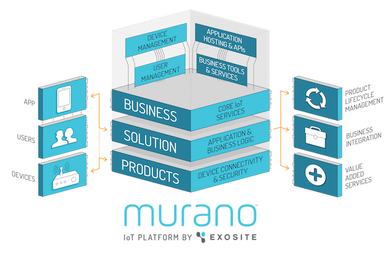

# Guide: Create a Solution

## Solution Overview



Murano Solutions allow developers to create and deploy custom Applications and API Services.  Solutions combines three key things:
* A custom API with definable end-point routes, scripted logic, and integration with a User Service for permission control
* Asset hosting for deploying static file based applications, like a CDN
* Service event handler scripts that have access to all Murano [services](/reference/services)

## Create a Solution

The Solution concept in Murano represents the application logic, user interfaces, and APIs for an IoT application. It provides the tools needed to build and deploy applications and services on top of IoT device data using concepts of data routing, integrated services, custom APIs, user auth/roles/permissions, and application asset hosting. This allows developers to create solution templates that contain the entire application functionality to deploy to end users or to provide a custom API for their products. 

### Web UI

To create a solution using the Web UI:

1. From the *Solutions* tab (https://www.exosite.io/business/solutions), click "+ NEW SOLUTION." 

   

2. Select *Start from scratch* and click the "ADD" button.

   

Once you have created a solution, you will need to find the Solution ID.

1. In Murano select *Solutions*.

2. Select the solution you just created.

3. Copy the Solution ID on this page.

   

### Murano CLI

To create a solution using the Murano CLI:

```sh
$ murano solution create <name>
```

This command will return the ID of your solution for the next step.

### Configure Your Solution

To configure Murano CLI to work with your newly created solution, use the config command of the Murano CLI tool.

```sh
$ murano config solution.id <solutionid>
```