# Getting-started Guide: Prototype a Connected Lightbulb Using an ESP8266 Thing Dev Board

In this guide, you will set up an ESP8266 Thing Dev Board to act as a connected lightbulb. You will then create a development dashboard within Murano, where you can see temperature and humidity data from the device and have the ability to remotely turn the lightbulb on and off.

**NOTE:** The ESP8266 Thing Dev Board has a known issue when using Arduino on a Windows machine. Please make sure digital pin 0 is grounded, or use a Linux machine to complete this guide.

# Requirements

## Hardware Setup

To complete this guide, you will need the following hardware: 

* [SparkFun ESP8266 Thing Dev Board](https://www.sparkfun.com/products/13711)

* [RHT03 humidity and temperature sensor ](https://www.sparkfun.com/products/10167)

* 10K ohm resistor (for digital pin pull-up)

* 330 ohm resistor

* LED (suggest green or yellow)

* Micro-USB B cable

To begin, connect the components as shown in the image below.

  

## Software Setup

To complete this guide, you will need to set up the Arduino IDE as well as the board support for the ESP8266.

New to Arduino? Below are a few links to get an understanding of Arduino since this guide does not cover every concept of the Arduino IDE and hardware (in this case, the SparkFun ESP8266 Thing Dev Board). Note that Arduino supports a number of hardware platforms, not just Arduino-branded boards themselves, like the ESP8266 Thing Dev Board.

* [SparkFun ESP8266 Thing Dev Board](https://www.sparkfun.com/products/13711)

* [Arduino Getting Started](https://www.arduino.cc/en/Guide/HomePage0)

Install tools and libraries:

1. First download and install the Arduino IDE from the [Arduino website](https://www.arduino.cc/en/Main/Software). 

2. Open the Arduino IDE, then install the ESP8266 Thing Dev Board board support: 

    1. Select *Arduino* > *Preferences..*. 

    2. In the *Preferences* popup that appears, paste this link into the *Additional Boards Manager URLs* field: `http://arduino.esp8266.com/stable/package_esp8266com_index.json`

      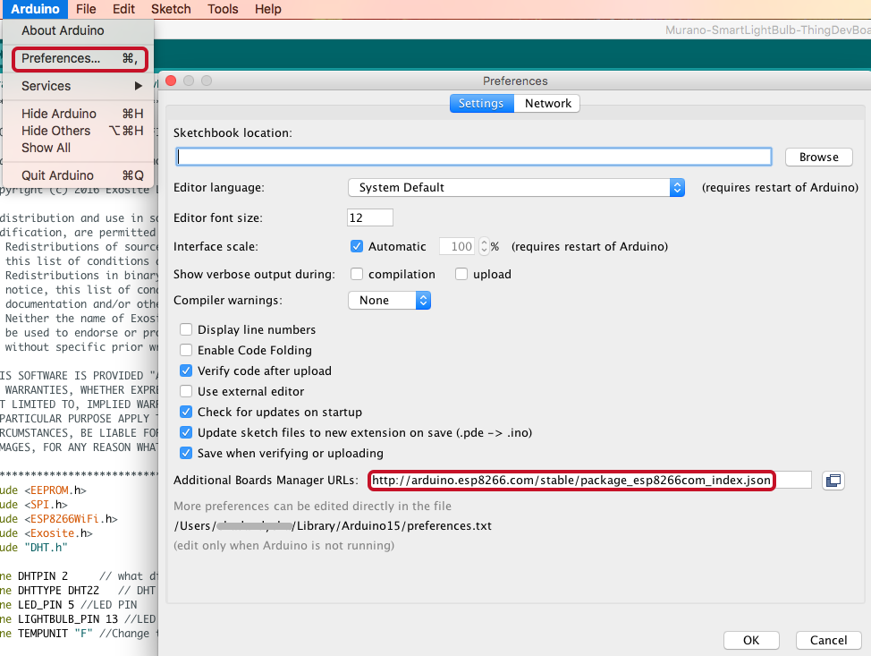

    3. Click OK.

3. Next install the Exosite Arduino library, Adafruit DHT Unified library, and DHT Sensor library: 

    4. Select *Sketch* > *Include Library* > *Manage Libraries...* 

      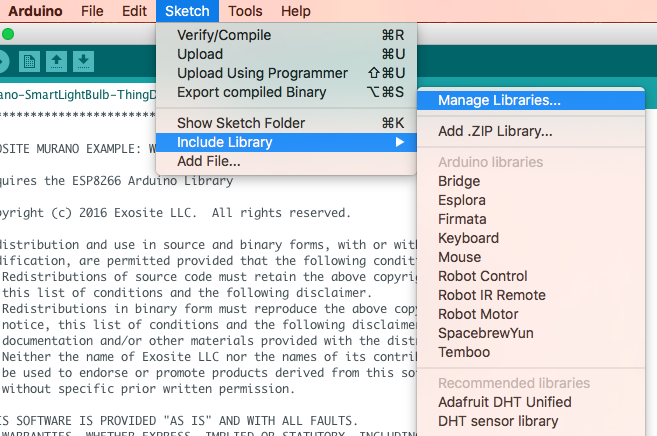

    5. In the *Library Manager* popup that appears, search for "Exosite." 

    6. Select version 2.4.1 or greater and click Install. 

      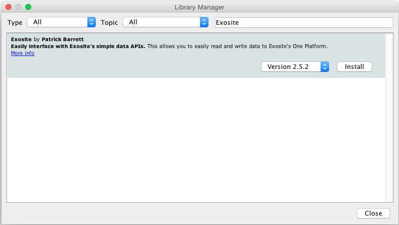

    7. Next, search for "DHT." Install both the Adafruit DHT Unified and DHT sensor library.

      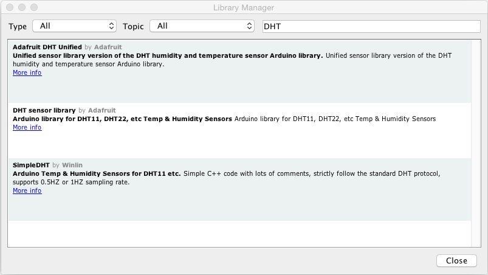 

    8. When complete, click Close.

# Getting Started

## Create a Product in Murano

In this section, you will create a new Product in Murano.

1. In Murano, navigate to the [Product tab](http://exosite.io/business/products).

2. To add a Product, click New Product.

  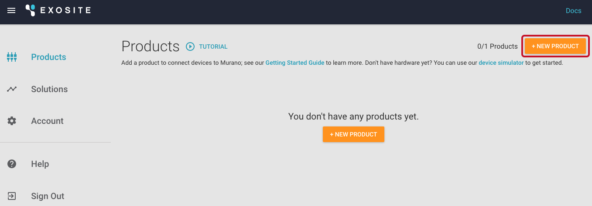

3. In the *New Product* popup: 

    1. Enter a name for the Product in the *Name* field. 

    2. Select *Start from scratch* in the *Choose starting point* drop-down menu.

    3. Copy and paste the following URL into the *Link to your product template* field: 

      `https://raw.githubusercontent.com/exosite-garage/arduino_exosite_library/master/examples/Murano-SmartLightBulb-ThingDevBoard/product_spec_smart_lightbulb_example.yaml`

      This will allow you to use a product template spec file to set up the product definition. 

    4. Click Add. 

  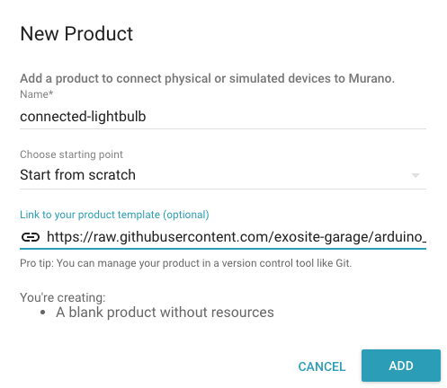

4. Once the Product has been created, navigate to the Definition tab.

These are the resources your device will interact with. They were created automatically from the product template you selected in the previous step. In this example, the device will generally write data to the temperature, humidity, and uptime aliases, while watching the state alias for changes.

  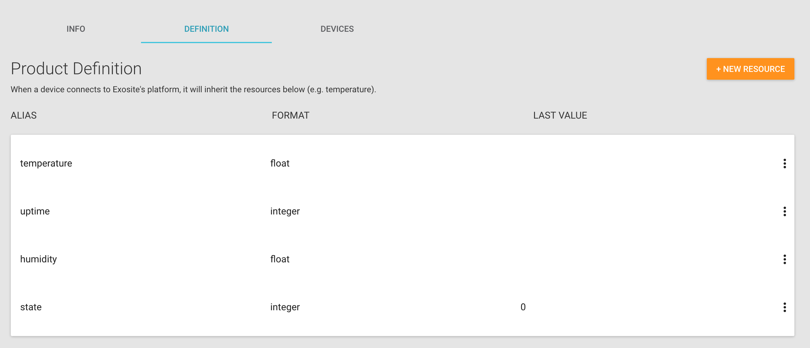

**NOTE**: If you did not use the template URL in the previous step, you can manually configure your product definition. From the Definition tab, configure your dataport resources as specified below. Also, set the default value for "state" to 0 so the device has a default value it reads to know to turn the LED on or off. Click on the *state* resource in the Definition tab and write a 0 to the value.
```
* alias: _temperature_, format: _float_
* alias: _humidity_, format: _float_
* alias: _uptime_, format: _integer_
* alias: _state_, format: _integer_


```
## Flash and Run the Example Application

In this section, you will flash and run an example application for a connected lightbulb in Arduino. 

4. In Arduino, create a new sketch by selecting *File* > *New*.

5. Load the Exosite connected lightbulb example sketch with device application code by selecting *File* > *Examples* > *Exosite* > *Murano-SmartLightBulb-ThingDevBoard*. 

  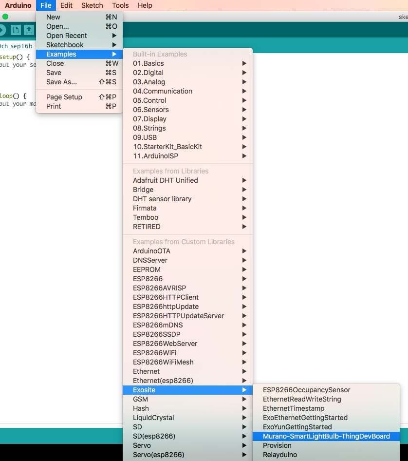

6. In your sketch, edit the Wi-Fi configuration parameters for your local Wi-Fi network (SSID and password) and the Murano Product ID parameters for your product. 

  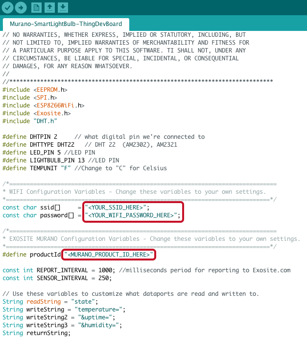

  To find your Product ID:

    1. In Murano, navigate to the Products tab and select the product you just created. 

    2. On the Info tab, locate the Product ID and copy it.

    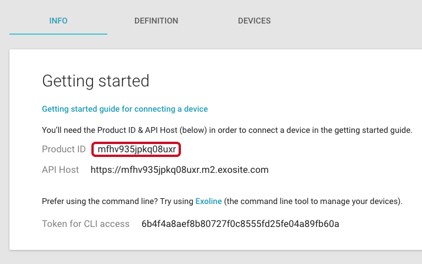

8. Make sure the Thing Dev Board is connected to your computer via a micro-USB cable and select your device’s serial port with *Tools* > *Port* > *"your_port"*. 

  **NOTE:** Your device will likely be the only one. If it’s not, you can figure out which is correct by unplugging your device and finding which device disappears.
    
    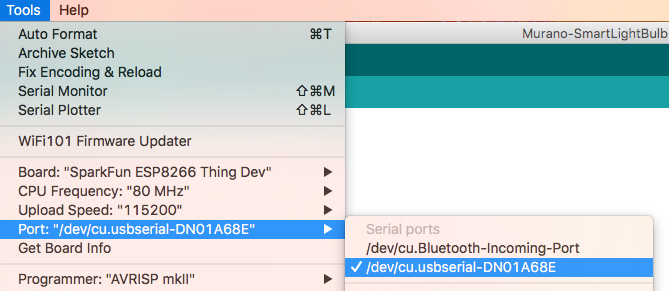

9. Click Upload. This will first compile and then download the firmware image to the selected board.
  
  

10. Open the serial monitor and set it to 115200 Baud.  
  
  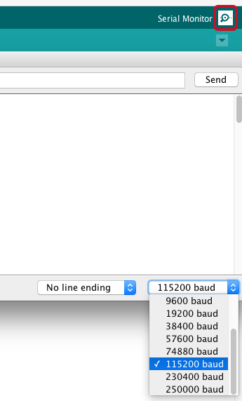

11. Locate the MAC address in the serial monitor output; this will serve as the device identifier that will enable you to add a unique device to your Product in Murano. The device identifier or serial number is device-specific. In this situation, the Exosite Arduino library uses the device's pre-programmed MAC address.
  
  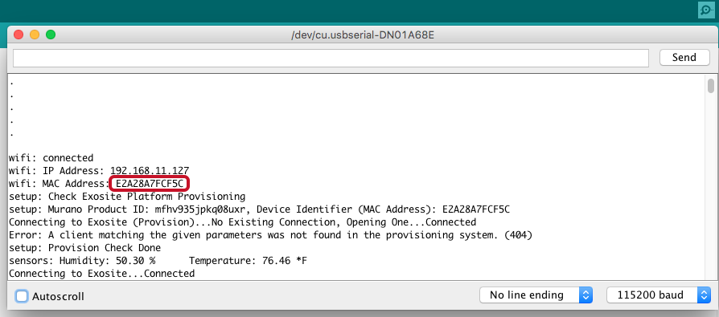

  **NOTE:** Deselect the "Autoscroll" checkbox if the log window goes past the top.

## Add a Device in Murano

In this section, you will create a device under your Product in Murano.

1. In Murano, navigate to the Product tab and select the product you just created.  

2. Navigate to the Devices tab and click New Device. 

  

3. In the *New Device* popup: 

  1. Enter a name for the device in the *Name* field. This will only be used to help you distinguish between devices. 

  2. Enter the device identifier (MAC address) you identified in the previous section in the *Identity* field.

  3. Click Create.

  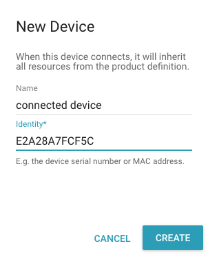

4. Back in Arduino, click Upload again to flash the sketch to the board one last time.

5. Open the serial monitor and verify that your device activated and provisioned successfully using the serial output.

  

3. In Murano, navigate to the Devices tab for this Product, select your device, and ensure data is showing up on the Resources tab.

  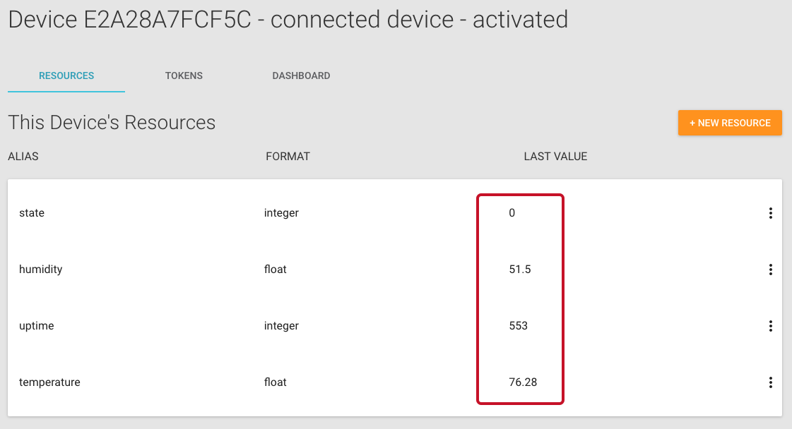

## Create a Dashboard in Murano

In this section, you will create a dashboard to view the data from the connected lightbulb and turn it on and off remotely. 

1. From the Resources tab for your device, open the Dashboard tab. 

  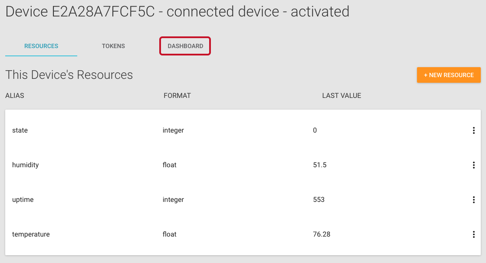

2. Click Add Pane to house the widgets you will create.

  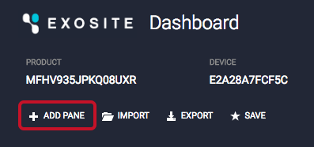

3.  In the pane that appears, click the plus sign to add a widget.  

  

4. In the *Widget* popup that appears, select *Text* from the *Type* drop-down menu and complete the remaining fields (*Title*: Temperature; *Value*: datasources["temperature"]; *Units*: F). Click Save.

  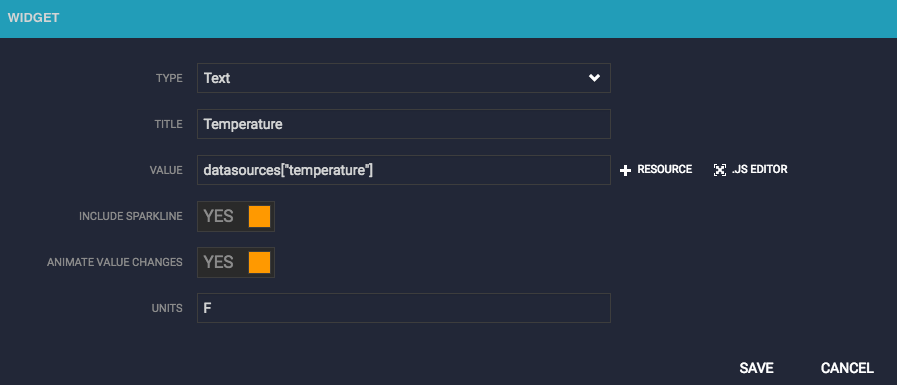

5. Create another pane and text widget for humidity and complete the remaining fields (*Title:* Humidity; *Value:* datasources["humidity"]; *Units:* %). Click Save.

  

6. Then add a third pane and widget. In the *Widget* popup that appears, select *Toggle Switch* from the *Type* drop-down menu and complete the remaining fields (*Title*: On / Off; *Value*: datasources["state"]; *On Value*: 1; *Off Value*: 0). Click Save.

  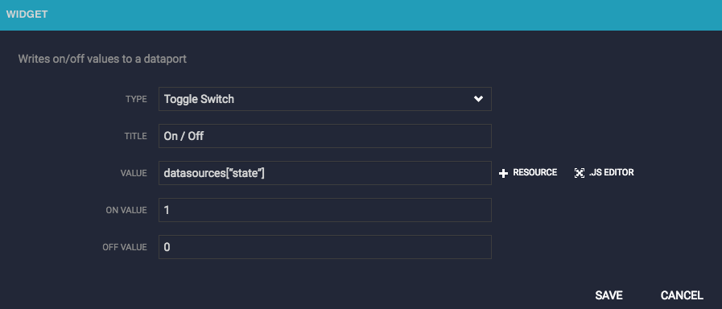

7. Now turn the light on and off using the toggle switch on your dashboard. You should see the LED turn on and off on the Thing Dev Board accordingly. 


  


Congratulations—you just remotely turned a light on and off.

[UP NEXT: CREATE A SOLUTION >>](http://beta-docs.exosite.com/murano/get-started/solutions/exampleapp/)

