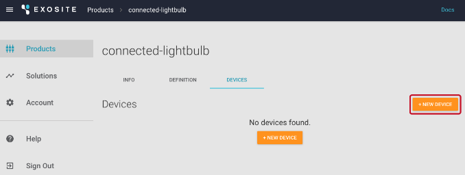
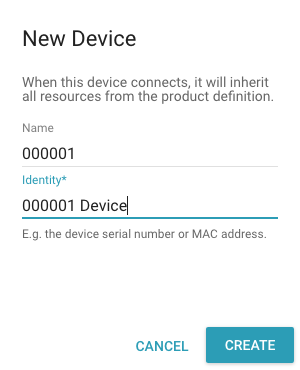

# Guide: Manually Activate a Connected Lightbulb Device Using APIs

In this guide, you will manually activate a device to act as a connected lightbulb using API calls. 

**NOTE:** This simulator script uses the [Device HTTP API](https://github.com/exosite/docs/blob/master/murano/products/device_api/http).

Devices need two pieces of information to activate with the platform. These are the Product ID (attained by creating a product) and a Unique Identifier Serial Number. The Product ID can be found on the *INFO* tab of the Product [page](https://www.exosite.io/business/products).


# Hardware Setup

This example does not require hardware. It assumes developers will use command line CURL commands or implement in a language of choice using HTTP client library commands.

# Software Setup

## Using CURL

1. Add a New Device in your Murano product. Any Unique Identifier Serial Number is okay, but this example will use `000001`.

  

  

2. Run the following CURL command, first inserting your Product ID anywhere that says `<productid>`.

  ```
  curl -k https://<productid>.m2.exosite.com/provision/activate \
     -H "Content-Type: application/x-www-form-urlencoded; charset=utf-8" \
     -d "vendor=<productid>&model=<productid>&sn=000001"

  ```

3. The response should return a 40-character string, called the CIK. This CIK is the private device API key which is typically stored securely in the device’s non-volatile memory. The device is now activated.

4. To make write or read requests, you must use this CIK from the Activation call. Here are examples of writing and reading data defined in the Example Consumer Application product definition. Replace with your 40-character CIK.


  ```
  curl -k http://m2.exosite.com/onep:v1/stack/alias?state \
      -H "X-Exosite-CIK: <CIK_HERE>" \
      -H "Accept: application/x-www-form-urlencoded; charset=utf-8" \
      -d "temperature=72&humidity=23&uptime=1"

  ```


## Using Straight HTTP Requests

1. Add a Device in your Murano product. Any Unique Identifier Serial Number is okay, but this example will use `000001`.

  

  

2. Run the following HTTP request, first inserting your Product ID anywhere that says `<productid>`.

  ```
  POST /provision/activate HTTP/1.1
  Host: <productid>.m2.exosite.com
  Content-Type: application/x-www-form-urlencoded; charset=utf=8
  Content-Length: <length>

  vendor=<productid>&model=<productid>&sn=000001
  ```

3. The response should return a 40-character string, called the CIK. This CIK is the private device API key which is typically stored securely in the device’s non-volatile memory. The device is now activated.

4. To make write or read requests, you can use this CIK. Here are examples of writing and reading using the data ports defined in the Example Consumer Application product definition.

  ```
  POST /onep:v1/stack/alias?state HTTP/1.1
  Host: m2.exosite.com
  X-Exosite-CIK: <CIK>
  Accept: application/x-www-form-urlencoded; charset=utf-8
  Content-Type: application/x-www-form-urlencoded; charset=utf-8
  Content-Length: <length>

  temperature=72&humidity=23&uptime=1

  ```
