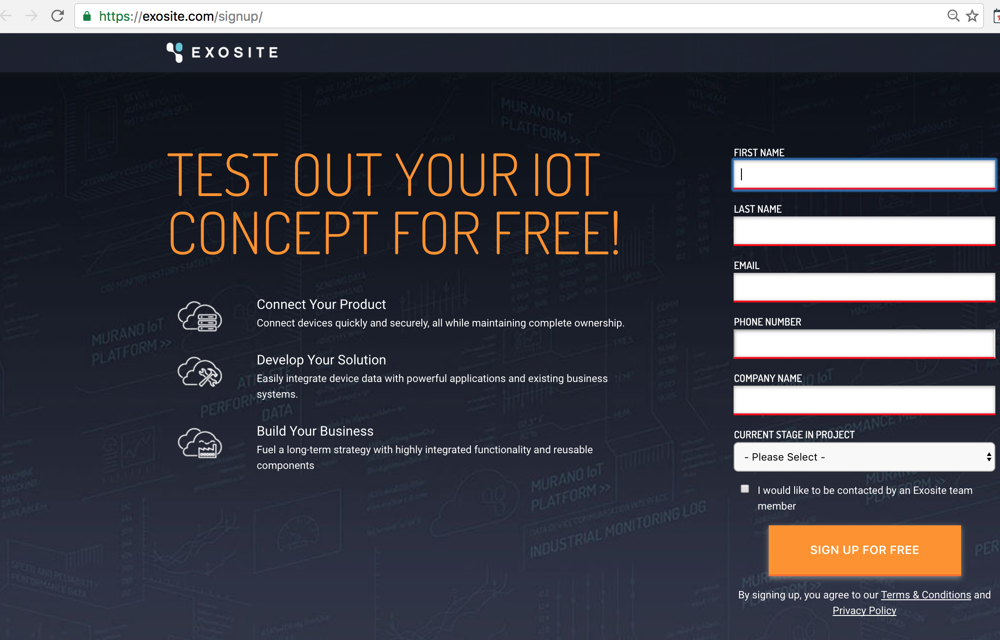
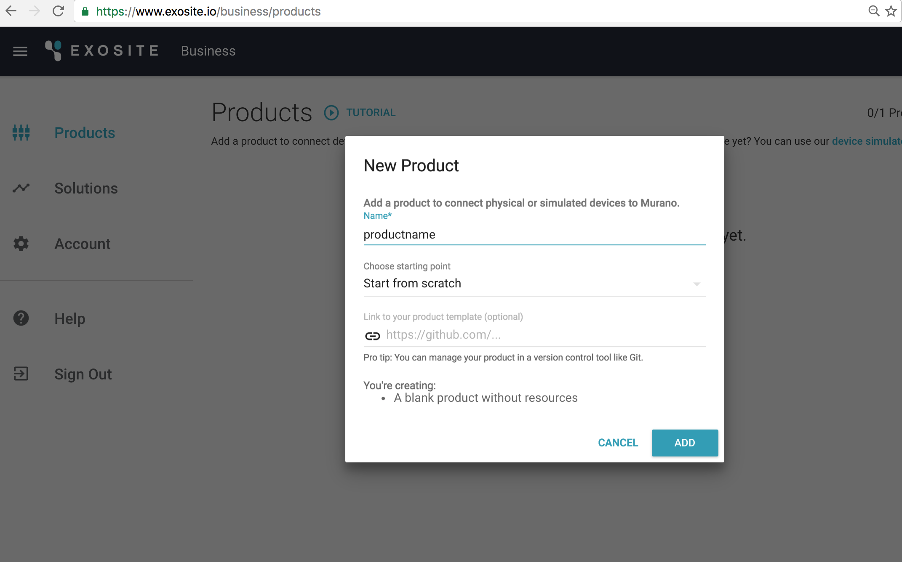

# HVAC Reference Application Tutorial

This HVAC Reference Application is an interactive tutorial that allows users to learn the core features of Murano from both a hardware and software perspective. You will have the option to prototype or simulate the implementation of an HVAC monitoring system with simple controls using the Murano platform.

# Requirements
This tutorial is designed to be flexible based the hardware, software, and tools you have available. If you have one of the supported hardware items, you will be able to create a full IoT solution with working hardware. If you do not have any of the supported hardware available, we have created a Python based simulator that will help you get started.

## Supported Hardware

### SeeedStudio BeagleBone Green Wireless

[https://beagleboard.org/green-wireless](https://beagleboard.org/green-wireless)

SeeedStudio BeagleBone Green (BBG) is a low-cost, open-source, community-supported development platform for developers and hobbyists. It is a joint effort by BeagleBoard.org and Seeed Studio. It is based on the classical open-source hardware design of BeagleBone Black and has been developed into this differentiated version. The BBG includes two Grove connectors, making it easier to connect to the large family of Grove sensors. The onboard HDMI is removed to make room for these Grove connectors.

[http://wiki.seeed.cc/BeagleBone_Green/](http://wiki.seeed.cc/BeagleBone_Green/) 

### TI CC3200 SimpleLink™ Wi-Fi® and Internet-of-Things solution

[http://www.ti.com/product/CC3200](http://www.ti.com/product/CC3200)

## Software

### Murano ClI

Murano CLI is a command-line utility for working with Murano. Think of it as a way to simplify and automate repetitious tasks for those who are comfortable with the command-line interface. 

[https://github.com/tadpol/MrMurano#mrmurano](https://github.com/tadpol/MrMurano#mrmurano)

### Python

All code written for the simulator in this tutorial has been written to work with Python 2 and 3, which can be downloaded from the [Python website](https://www.python.org/).

### Web Browser

You'll need a web browser for the initial steps in this tutorial.

# Getting Started

In this section you will walk through the process of setting up your account with Murano and preparing to run the simulator or actual hardware. 

## Create an Account

To get started with this tutorial, you will need to create an Exosite account using your web browser of choice. 

1. If you do not have an Exosite account, you can sign up here ([https://exosite.com/signup/](https://exosite.com/signup/)).

   
   
   

## Create Business

1. Once you have an active account and have logged in, you can navigate to the following URL to see your newly created business [https://www.exosite.io/business/memberships](https://www.exosite.io/business/memberships).

   

1. Click on your business to access your business page. 
   
## Install Murano CLI

To continue this tutorial, you'll need to open your terminal.

```
Murano CLI is the command-line tool that interacts with Murano and makes tasks easier. Murano CLI makes it simple to deploy code to a solution, import many product definitions at once, set up endpoints and APIs, and more. 
```

Murano CLI is a Ruby based command-line interface. Murano CLI will be used for most actions throughout the rest of this tutorial.

Ruby is most likely already installed on your system. Check to see if Ruby is installed first by opening up a terminal window and typing the following command.  

**Note:** Always copy and paste what comes after the $.

```sh
$ which gem
```

If you see something like `/usr/bin/gem`, then Ruby is already installed. 

```
If you do not have Ruby installed, the official Ruby docs will help you get it installed:
[https://www.ruby-lang.org/en/documentation/installation/](https://www.ruby-lang.org/en/documentation/installation/) 
```

Once Ruby is installed, install Murano CLI by running this command:

```sh
$ sudo gem install ExositeMurano
```

If prompted, please enter your local computer password.

## Download the HVAC code

This tutorial uses a common codebase that includes a web application and specifications for the hardware. The code has been written to be flexible and works with multiple hardware platforms or the Python simulator.

[https://www.github.com/exosite/hvac-reference-app/release/link.zip](https://www.github.com/exosite/hvac-reference-app/release/link.zip)

## Create a Solution

Next you need a place to deploy HVAC solution code. 

### Web UI

To create a solution using the Web UI:

1. From the *Solutions* tab (https://www.exosite.io/business/solutions), click "+ NEW SOLUTION." 

   

2. Select *Start from scratch* and click the "ADD" button.

   

Once you have created a solution, you will need to find the Solution ID.

1. In Murano select *Solutions*.

2. Select the solution you just created.

3. Copy the Solution ID on this page.

   

### Murano CLI

To create a solution using the Murano CLI:

```sh
$ murano solution create <name>
```

This command will return the ID of your solution for the next step.

### Configure Your Solution

To configure Murano CLI to work with your newly created solution, use the config command of the Murano CLI tool.

```sh
$ murano config solution.id <solutionid>
```

## Create a Product

Next, you will need to create a product. The product you create is the virtual representation of the BBG’s physical hardware and sensors that will send data to the Murano platform. 

### Web UI

To create a new product using the Web UI:

1. Navigate to the following URL: 
   [https://www.exosite.io/business/products](https://www.exosite.io/business/products)

   

1. Click on "+ NEW PRODUCT." 

1. Name your product. Note: Your product name cannot contain any capital letters. 

1. Open the *Choose Starting Point* dropdown, select *Start from scratch*, and click the "ADD" button. In the next step you can use code to configure your product.

   

Before continuing you will need to find the ID of the product you created.

1. In Murano select *Products*.

2. Select the product you just created.

3. Copy the Product ID on this page.

   


### Murano CLI

To create a new production using the Murano CLI:

```sh
$ murano product create <name>
```

This command will return the ID of your product for the next step.

## Configure Your Product

To configure your product you can use the config command of the Murano CLI tool. This command tells Murano CLI which product to use. 

```sh
$ murano config product.id <productid>
```

Executing the command below will set the product definition for this example as defined in the `product-spec.yaml` file. 

```
$ murano product spec push --file spec/product-spec.yaml 
```
This command sets up all of the data aliases that we will use in this example. You can now see them by going to [https://www.exosite.io/business/products](https://www.exosite.io/business/products) and clicking the 'Definition' tab. Many of the aliases are used by Gateway Engine. Notice the aliases like 'ambient_temperature', 'desired_temperature', and 'heat_on'. These are all the different resources that will used for this HVAC tutorial. 

## Link Product to Solution

### Web UI

### Murano CLI


## Next Steps

At this point your product is configured and ready to start receiving data from your hardware of choice or the simulator.

If you have BBG hardware available, you will walk through installing GWE on the BBG, connecting the BBG and its sensors to the Murano platform, and connecting the sensor data to a Murano solution. If you do not have hardware available, you will walk through running the simulator. This should provide you with an easy starting point for connecting devices and creating solutions to visualize and interpret your device's data.